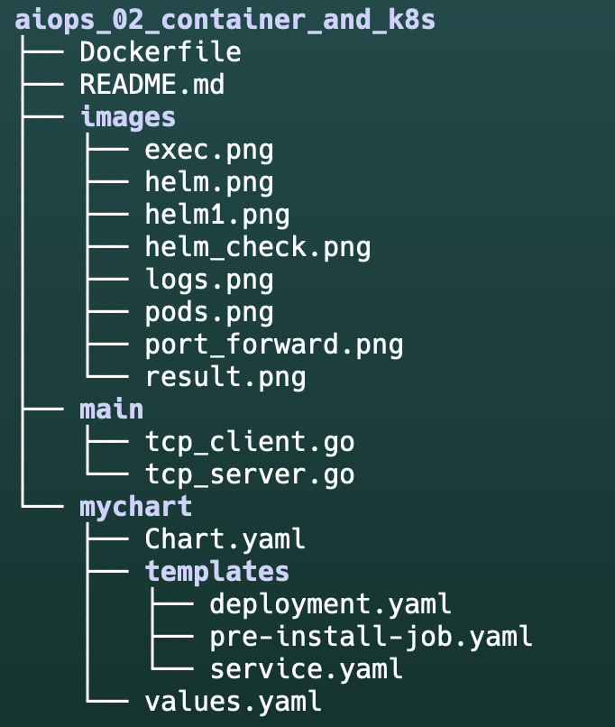

# TCP Server Deployment on Kubernetes

This document outlines the process of deploying a TCP server on a Kubernetes cluster using Docker and Helm.

## Prerequisites

- Docker
- Kubernetes (KIND cluster)
- Helm
- Go (for building the server)
- [KIND](https://kind.sigs.k8s.io/) (for creating a Kubernetes cluster on local )

## Directory Structure


## Steps

### 1. Prepare the Go TCP Server

Copy files `tcp_server.go` and `tcp_client.go` in the `aiops_02_container_and_k8s/main/` directory with the following content:

```

### 2. Create Dockerfile

Create a `Dockerfile` in the `aiops_02_container_and_k8s/` directory


### 3. Build and Load Docker Image

```bash
docker build -t tcp-demo:latest .
kind load docker-image tcp-demo:latest
```

### 4. Create Helm Chart

Create a new Helm chart:

```bash
helm create mychart
```


### 5. Deploy with Helm

```bash
helm install test-release ./mychart
```


### 6. Verify Deployment

```bash
kubectl get pods
```


### 7. Access the Server

```bash
kubectl port-forward service/test-release-tcp-service 3333:3333
```


or in 2 terminals

```bash
kubectl logs -f deployment/test-release-tcp-server 

kubectl exec -it deployment/test-release-tcp-server -- /app/client   
```


### 8. View Server Logs

```bash
kubectl logs -f deployment/test-release-tcp-server
```


## 9 Troubleshooting

```bash
kubectl exec -it deployment/test-release-tcp-server -- /bin/sh
```


## Note

Remember to modify the `CONN_HOST` in your `tcp_server.go` from `"localhost"` to `"0.0.0.0"` to allow connections from outside the container. After making this change, you'll need to rebuild the Docker image and redeploy.
