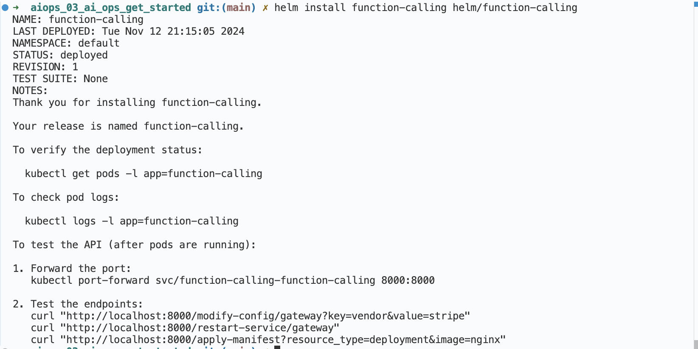
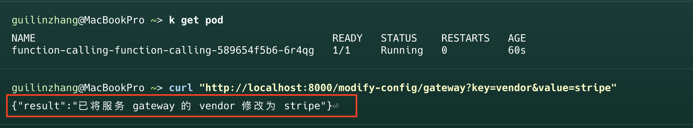

## AIOps Function Calling 

实现了三个核心函数用于模拟运维操作，并可通过Function Calling进行调用：

### 核心函数

1. `modify_config(service_name: str, key: str, value: Any)`
   - 用于修改服务配置
   - 参数：
     - service_name: 服务名称
     - key: 配置键
     - value: 配置值

2. `restart_service(service_name: str)`
   - 用于重启服务
   - 参数：
     - service_name: 服务名称

3. `apply_manifest(resource_type: str, image: str)`
   - 用于部署资源
   - 参数：
     - resource_type: 资源类型
     - image: 容器镜像

### 使用示例

以下是一些常见的使用场景：

1. 修改服务配置：

### Helm Chart 部署说明

本项目包含了Helm Chart，可以直接部署到Kubernetes集群中：

1. 确保已安装Helm和配置好Kubernetes集群
2. 部署应用：
   ```bash
   # 在 aiops_03_ai_ops_get_started 目录下运行
   helm install function-calling helm/function-calling
   ```

3. 验证部署：
   ```bash
   kubectl get pods
   kubectl get services
   ```

4. 测试API：
   ```bash
   # 端口转发
   kubectl port-forward svc/function-calling-function-calling 8000:8000

   # 测试API
   curl "http://localhost:8000/modify-config/gateway?key=vendor&value=stripe"
   curl "http://localhost:8000/restart-service/gateway"
   curl "http://localhost:8000/apply-manifest?resource_type=deployment&image=nginx"
   ```

5. 卸载：
   ```bash
   helm uninstall function-calling
   ```
### 测试结果




