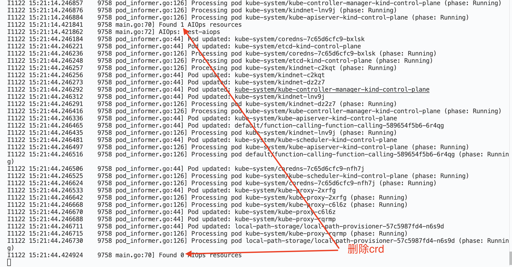

# Kubernetes Client-Go Basics and Practice

本项目实现了两个核心功能：
1. 使用 Informer + RateLimitingQueue 监听 Pod 事件
2. 创建和监听自定义 CRD 资源

## 0. 项目结构
```
.
├── README.md
├── go.mod
├── main.go
├── pkg/
│   ├── informer/
│   │   └── pod_informer.go
│   └── crd/
│       ├── aiops_types.go
│       └── register.go
└── manifests/
    └── aiops_crd.yaml
```

## 1. 快速开始

1. 安装 CRD：
```bash
kubectl apply -f manifests/aiops_crd.yaml
```

2. 运行程序：
```bash
go mod tidy # 下载依赖并生成 go.sum
go run main.go # 运行程序
```

3. 测试 Pod 事件监听：
```bash
# 创建一个测试 Pod
kubectl run nginx --image=nginx

# 删除 Pod
kubectl delete pod nginx
```

4. 测试 AIOps CRD：
```bash
# 创建一个 AIOps 资源实例
cat <<EOF | kubectl apply -f -
apiVersion: aiops.geektime.com/v1alpha1
kind: AIOps
metadata:
  name: test-aiops
spec:
  model: "gpt-3.5-turbo"
  prompt: "分析 Pod 异常"
  target: "default/nginx"
EOF
```

## 2. 测试结果
1. 启动程序后，会创建一个 Informer 监听 Pod 事件

2. 首先测试 Pod 事件监听：
```text
kubectl run nginx --image=nginx

# 观察日志输出，应该能看到类似这样的信息：
# Pod added: default/nginx
# Processing pod default/nginx (phase: Pending)
# Pod updated: default/nginx
# Processing pod default/nginx (phase: Running)
```

```text
# 然后删除这个 Pod
kubectl delete pod nginx

# 观察日志输出，应该能看到：
# Pod deleted: default/nginx
```


3. 然后测试 AIOps CRD：
```text
# 首先安装 CRD（如果还没安装）
kubectl apply -f manifests/aiops_crd.yaml

# 创建一个 AIOps 资源实例
cat <<EOF | kubectl apply -f -
apiVersion: aiops.geektime.com/v1alpha1
kind: AIOps
metadata:
  name: test-aiops
spec:
  model: "gpt-3.5-turbo"
  prompt: "分析 Pod 异常"
  target: "default/nginx"
EOF
```

```text
# 观察程序日志，每30秒应该能看到类似这样的输出：
# Found 1 AIOps resources
# AIOps: test-aiops

# 可以查看创建的 AIOps 资源
kubectl get aiops

# 删除测试资源
kubectl delete aiops test-aiops
```


## 3. 功能说明

1. Pod Informer
   - 监听所有命名空间的 Pod 事件
   - 使用 RateLimitingQueue 处理事件
   - 支持 Add/Update/Delete 事件处理

2. AIOps CRD
   - Group: aiops.geektime.com
   - Version: v1alpha1
   - Kind: AIOps
   - 使用 dynamic client 获取资源
