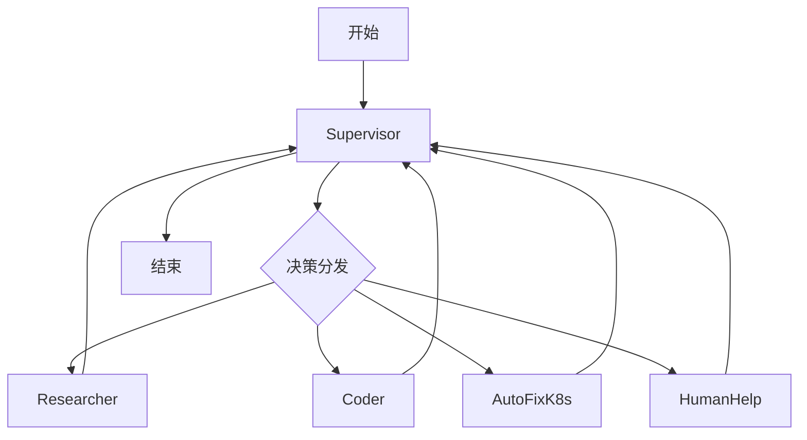

# 多 Agent 协同的 K8s 自动修复系统

## 1. 项目概述

这个module基于多个 AI Agent 协同工作的 Kubernetes 自动修复系统。系统通过多个专门的 Agent 相互配合，实现对 Kubernetes 集群问题的自动检测、分析和修复。

## 2. 系统架构

### 2.1 Agent 组成

系统包含五个专门的 Agent：

1. **管理员 Agent (Supervisor)**
   - 负责任务分发和协调
   - 决定下一步由哪个 Agent 执行
   - 控制整个工作流程

2. **研究员 Agent (Researcher)**
   - 使用 Tavily 搜索工具
   - 收集问题相关信息
   - 提供解决方案建议

3. **代码执行 Agent (Coder)**
   - 执行 Python 代码
   - 实现自动化操作
   - 验证解决方案

4. **自动修复 Agent (AutoFixK8s)**
   - 生成修复用的 Patch JSON
   - 执行 K8s 资源修复
   - 验证修复结果

5. **人工协助 Agent (HumanHelp)**
   - 发送飞书告警
   - 请求人工干预
   - 记录问题和解决方案

### 2.2 工作流程



## 3. 核心功能

### 3.1 自动问题检测

- 监控 K8s 事件
- 识别 Warning 和 Error
- 收集相关上下文

### 3.2 智能分析和修复

1. **问题分析**
   - 使用 Researcher 搜索相关信息
   - 结合历史经验
   - 生成解决方案

2. **自动修复**
   - 生成修复 Patch
   - 自动应用修复
   - 验证修复结果

3. **人工干预**
   - 无法自动修复时
   - 发送飞书告警
   - 记录处理过程

## 4. 使用示例

### 4.1 OOM 问题修复

使用提供的 stress 测试用例：

```yaml
apiVersion: apps/v1
kind: Deployment
metadata:
  name: memory-hog
spec:
  replicas: 1
  containers:
    - name: memory-hog
      image: polinux/stress
      resources:
        limits:
          memory: "100Mi"
      command: ["stress"]
      args: ["--vm", "1", "--vm-bytes", "200M"]
```

系统会：
1. 检测到 OOM 问题
2. 分析内存使用情况
3. 自动调整资源限制
4. 或发送告警请求人工处理

## 5. 部署和配置

### 5.1 前置条件

```bash
pip install -U langgraph langchain langchain_openai langchain_experimental \
    langsmith pandas kubernetes openai
```

### 5.2 环境变量

```bash
export OPENAI_API_KEY="your-api-key"
export TAVILY_API_KEY="your-tavily-key"
```

### 5.3 运行系统

```bash
# 1. 部署测试用例
kubectl apply -f oom-stress.yaml

# 2. 运行多 Agent 系统
python multi-agent.ipynb
```

## 6. 特点和优势

1. **多 Agent 协同**
   - 分工明确
   - 相互配合
   - 灵活可扩展

2. **自动化程度高**
   - 自动检测问题
   - 自动执行修复
   - 自动验证结果

3. **人机结合**
   - 优先自动修复
   - 必要时人工介入
   - 经验积累和改进

## 7. 最佳实践

1. **监控配置**
   - 合理设置资源限制
   - 配置适当的监控指标
   - 设置告警阈值

2. **修复策略**
   - 制定清晰的修复流程
   - 记录修复经验
   - 持续优化策略

3. **安全考虑**
   - 限制修复权限
   - 记录修复操作
   - 设置回滚机制

## 8. 注意事项

1. 谨慎使用自动修复功能
2. 定期检查和更新 API 密钥
3. 保持充分的日志记录
4. 定期审查自动修复策略
